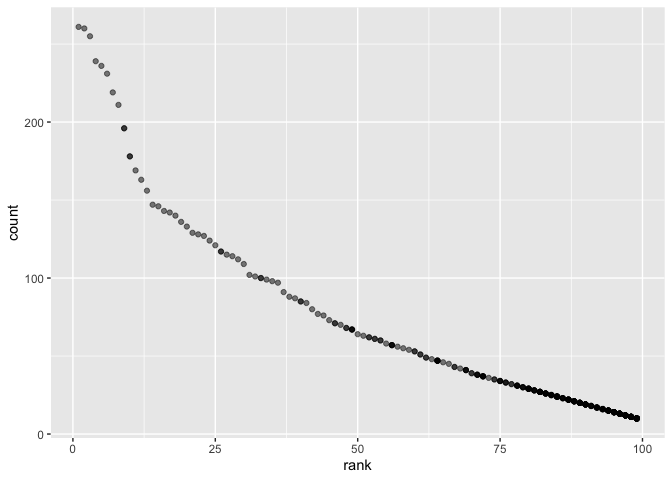

p8105\_hw2\_xh2395
================
Xin He
9/27/2019

## Problem 1

**Read and clean the Mr. Trash Wheel sheet:**

``` r
Mr_Trash_data = 
  read_excel(path = "./data/HealthyHarborWaterWheelTotals2018-7-28.xlsx", sheet = "Mr. Trash Wheel", range = cell_cols("A:N")) %>% 
  janitor::clean_names() %>%
  drop_na(dumpster) %>% 
  mutate(sports_balls = as.integer(round(sports_balls)))
```

**Read and clean precipitation data for 2018**

``` r
preci2018_data = 
  read_excel(path = "./data/HealthyHarborWaterWheelTotals2018-7-28.xlsx", sheet = "2018 Precipitation", range = "A2:B14") %>% 
  janitor::clean_names() %>%
  drop_na(total) %>% 
  mutate(year = 2018)
```

**Read and clean precipitation data for 2017**

``` r
preci2017_data = 
  read_excel(path = "./data/HealthyHarborWaterWheelTotals2018-7-28.xlsx", sheet = "2017 Precipitation", range = "A2:B14") %>% 
  janitor::clean_names() %>%
  drop_na(total) %>% 
  mutate(year = 2017)
```

**Combine precipitation datasets**

``` r
com_data = full_join(preci2017_data, preci2018_data, by = NULL) %>% 
  mutate(month = month.name[month])
```

    ## Joining, by = c("month", "total", "year")

In dataset “Mr\_Trash\_data”, the number of observations is 285, and the
number of variables is 14. Key variables include “dumpster” and
“sports\_balls”.

In dataset “preci2018\_data”, the number of observations is 7, and the
number of variables is 3. Key variables include “year”, “month” and
“total”.

In dataset “preci2017\_data”, the number of observations is 12, and the
number of variables is 3. Key variables include “year”, “month” and
“total”.

In dataset “com\_data”, the number of observations is 19, and the number
of variables is 3. Key variables include “year”, “month” and “total”.

The total precipitation in 2018 is 23.5 inches.

The median number of sports balls in a dumpster in 2017 is 8.

## Problem 2

**Clean the data in pols-month.csv**

``` r
pols_data = 
  read_csv("./data/pols-month.csv") %>% 
  janitor::clean_names() %>%
  separate(mon, into = c("year", "month", "day"), sep = "-") %>% 
  mutate(year = as.integer(year), month = as.integer(month), day = as.integer(day)) %>% 
  mutate(month = month.name[month]) %>% 
  mutate(president = ifelse(prez_gop %in% 0, "dem",
     ifelse(prez_gop %in% 1, "gop", "gop"))) %>% 
  select(-prez_gop, -prez_dem, -day)
```

    ## Parsed with column specification:
    ## cols(
    ##   mon = col_date(format = ""),
    ##   prez_gop = col_double(),
    ##   gov_gop = col_double(),
    ##   sen_gop = col_double(),
    ##   rep_gop = col_double(),
    ##   prez_dem = col_double(),
    ##   gov_dem = col_double(),
    ##   sen_dem = col_double(),
    ##   rep_dem = col_double()
    ## )

**Clean the data in snp.csv**

``` r
snp_data = 
  read_csv("./data/snp.csv") %>% 
  janitor::clean_names() %>% 
  separate(date, into = c("month", "day", "year"), sep = "/") %>% 
  mutate(year = as.integer(year), month = as.integer(month), day = as.integer(day)) %>% 
  mutate(month = month.name[month]) %>% 
  select(-day) %>% 
  arrange(year, month) %>% 
  select("year", everything())
```

    ## Parsed with column specification:
    ## cols(
    ##   date = col_character(),
    ##   close = col_double()
    ## )

**Tidy the unemployment data**

``` r
unemploy_data = 
  read_csv("./data/unemployment.csv") %>% 
  rename(January = Jan, February = Feb, March = Mar, April =  Apr, June = Jun, July = Jul,     Auguest = Aug, September = Sep, October = Oct, November = Nov, December = Dec)
```

    ## Parsed with column specification:
    ## cols(
    ##   Year = col_double(),
    ##   Jan = col_double(),
    ##   Feb = col_double(),
    ##   Mar = col_double(),
    ##   Apr = col_double(),
    ##   May = col_double(),
    ##   Jun = col_double(),
    ##   Jul = col_double(),
    ##   Aug = col_double(),
    ##   Sep = col_double(),
    ##   Oct = col_double(),
    ##   Nov = col_double(),
    ##   Dec = col_double()
    ## )

``` r
unemploy_tidy_data = 
  pivot_longer(
    unemploy_data, 
    January:December,
    names_to = "month", 
    values_to = "unemployment") %>% 
  janitor::clean_names()
```

**Join the datasets by merging snp into pols**

``` r
pols_snp_data = 
  left_join(pols_data, snp_data, by = c("year", "month"))
```

**Merging unemployment**

``` r
p_s_unemploy_data = 
  left_join(pols_snp_data, unemploy_tidy_data, by = c("year", "month"))
```

In dataset “pols\_data”, the number of observations is 822, and the
number of variables is 9. Key variables include “year”, “month” and
“president”. Range of years in this data is 1947-2015.

In dataset “snp\_data”, the number of observations is 787, and the
number of variables is 3. Key variables include “year”, “month” and
“close”. Range of years in this data is 1950-2015.

In dataset “unemploy\_tidy\_data”, the number of observations is 816,
and the number of variables is 3. Key variables include “year”, “month”
and “unemployment”. Range of years in this data is 1948-2015.

In dataset “pols\_snp\_data”, the number of observations is 822, and the
number of variables is 10. Key variables include “year”, “month”,
“president” and “close”. Range of years in this data is 1947-2015.

The resulting dataset “p\_s\_unemploy\_data”, merged previous three
datasets “pols\_data”, “snp\_data” and “unemploy\_tidy\_data” together
by year and month. In the resulting dataset, the number of observations
is 822, and the number of variables is 11. Key variables include “year”,
“month”, “president”,“close” and “unemployment”. Range of years in this
data is 1947-2015.

## Problem 3

**Load Popular\_Baby\_Names**

``` r
baby_data = 
  read_csv("./data/Popular_Baby_Names.csv") %>% 
  janitor::clean_names()
```

    ## Parsed with column specification:
    ## cols(
    ##   `Year of Birth` = col_double(),
    ##   Gender = col_character(),
    ##   Ethnicity = col_character(),
    ##   `Child's First Name` = col_character(),
    ##   Count = col_double(),
    ##   Rank = col_double()
    ## )

**Unify the names of a categorical
predictor**

``` r
baby_data$ethnicity[baby_data$ethnicity == "ASIAN AND PACI"] = "ASIAN AND PACIFIC ISLANDER"
baby_data$ethnicity[baby_data$ethnicity == "BLACK NON HISP"] = "BLACK NON HISPANIC"
baby_data$ethnicity[baby_data$ethnicity == "WHITE NON HISP"] = "WHITE NON HISPANIC"
```

**Unify upper case**

``` r
baby_data$childs_first_name = toupper(baby_data$childs_first_name)
```

**Remove duplicated rows**

``` r
baby_data = 
  dplyr::distinct(baby_data, year_of_birth, gender, ethnicity, childs_first_name, count, rank)
```

**The rank in popularity of the name “Olivia” as a female baby name over
time**

``` r
olivia_female = 
  filter(baby_data, gender == "FEMALE", childs_first_name == "OLIVIA") %>% 
  select(-count)

olivia_female1 = 
  pivot_wider(olivia_female, names_from = "year_of_birth", values_from = "rank") %>% 
  select("gender", "childs_first_name", "ethnicity", "2011", "2012", "2013", "2014", "2015", "2016")

olivia_female1
```

    ## # A tibble: 4 x 9
    ##   gender childs_first_na… ethnicity `2011` `2012` `2013` `2014` `2015`
    ##   <chr>  <chr>            <chr>      <dbl>  <dbl>  <dbl>  <dbl>  <dbl>
    ## 1 FEMALE OLIVIA           ASIAN AN…      4      3      3      1      1
    ## 2 FEMALE OLIVIA           BLACK NO…     10      8      6      8      4
    ## 3 FEMALE OLIVIA           HISPANIC      18     22     22     16     16
    ## 4 FEMALE OLIVIA           WHITE NO…      2      4      1      1      1
    ## # … with 1 more variable: `2016` <dbl>

**The most popular name among male children over time**

``` r
pop_male = 
  filter(baby_data, gender == "MALE", rank == 1) %>% 
  select(-count)

pop_male1 = 
  pivot_wider(pop_male, names_from = "year_of_birth", values_from = "childs_first_name") %>% 
  select("gender", "rank", "ethnicity", "2011", "2012", "2013", "2014", "2015", "2016")

pop_male1
```

    ## # A tibble: 4 x 9
    ##   gender  rank ethnicity          `2011` `2012` `2013` `2014` `2015` `2016`
    ##   <chr>  <dbl> <chr>              <chr>  <chr>  <chr>  <chr>  <chr>  <chr> 
    ## 1 MALE       1 ASIAN AND PACIFIC… ETHAN  RYAN   JAYDEN JAYDEN JAYDEN ETHAN 
    ## 2 MALE       1 BLACK NON HISPANIC JAYDEN JAYDEN ETHAN  ETHAN  NOAH   NOAH  
    ## 3 MALE       1 HISPANIC           JAYDEN JAYDEN JAYDEN LIAM   LIAM   LIAM  
    ## 4 MALE       1 WHITE NON HISPANIC MICHA… JOSEPH DAVID  JOSEPH DAVID  JOSEPH

**Scatter plot**

``` r
white_male =
  filter(baby_data, gender == "MALE", ethnicity == "WHITE NON HISPANIC", year_of_birth == "2016")

ggplot(white_male, aes(x = rank, y = count)) + 
  geom_point(alpha = .5) 
```

<!-- -->
